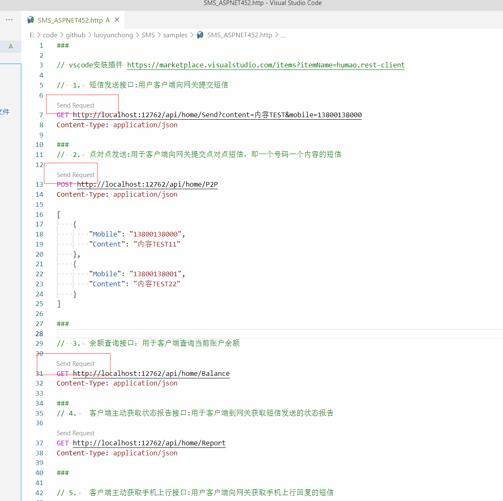

# 融合云信

融合云信是**中国联通**的短信平台，提供百亿发送量，稳定的平台服务。
- 海量发送能力：三大运营商短信全网覆盖，全国用户畅行无阻，支持短信双向收发
- 组织管理功能：提供多账号的统一计费、权限控制等能力，支持多层级管理模式
- 智能运维&立体化监控实时监控：精准掌握服务健康状况、服务拓扑，调用链跟踪可视化呈现、多维度关联分析，预防系统级故障

### 地址 [https://maap.wo.cn/index.html](https://maap.wo.cn/index.html)

具体可参考 [融合云信平台HTTP接口文档_V1.7.2](../../docs/融合云信平台HTTP接口文档_V1.7.2.doc)，也可去官网下载最新文档和使用手册

## Nuget Packages

| Package name| Version| Downloads|支持                                                                         |
|  ------------ |  ------------ |  ------------ | ------------|
| `IGeekFan.SMSUnicom` | [](https://www.nuget.org/packages/IGeekFan.SMSUnicom/) |  |.NET4.5.2/.NETStandard2.0


## 使用方式

### .NET Core

安装包
```console
dotnet add package IGeekFan.SMSUnicom
```

appsettings.json配置
```json
  "SMSUnicomOption": {
    "Cpcode": "",
    "Accesskey": "",
    "Excode": "",
    "SmsUrl": "http://rcsapi.wo.cn:8000",
    "SendMessageTemplateId": "57331"
  }
```
- `Cpcode` 登录自服务平台，进入商户信息页，【商户编码】值为cpcode
- `Accesskey` 登录自服务平台，进入系统设置页，【AccessKey】值为key
- `Excode` 扩展码：渠道自定义接入号的扩展码，可为空；为空时传空字符串”
- `SmsUrl` 融合云信接口地址，建议询问购买的服务商，或参考最新文档。
- `SendMessageTemplateId` 根据自己需要自行定义，项目中不是必须的。下面代码中用到了此变量，用于指定短信模板id（需要网站上申请模板）。

### 配置短信使用的对象
```csharp
builder.Services.Configure<SMSUnicomOption>(builder.Configuration.GetSection("SMSUnicomOption"));
```
### 注入短信服务
```csharp
builder.Services.AddTransient<SMSUnicomClient>();
```

### 同步方法：短信发送接口

多个手机号，中间用英文的**逗号**分割，最多支持300个手机号

```csharp
app.MapGet("/sendtempletmsg", (SMSUnicomClient smsClient, string mobiles, string msg) =>
{
  return  smsClient.SendTempletMsg(
        new SendTempletMsgRequest()
        {
            Templetid = builder.Configuration.GetSection("SMSUnicomOption:SendMessageTemplateId").Value,
            Mobiles = mobiles,
            Msg = msg
        });
});
```


### 异步方法：短信发送接口
```csharp
app.MapGet("/sendtempletmsg-async", async (SMSUnicomClient smsClient, string mobiles, string msg) =>
{
    return await smsClient.SendTempletMsgAsync(
          new SendTempletMsgRequest()
          {
              Templetid = builder.Configuration.GetSection("SMSUnicomOption:SendMessageTemplateId").Value,
              Mobiles = mobiles,
              Msg = msg
          });
});
```


### .NET FrameWork

安装包
```console
Install-Package IGeekFan.SMSUnicom
```

web.config中appSettings配置
```xml
<add key="Unicom_Cpcode" value="Cpcode" />
<add key="Unicom_Accesskey" value="Accesskey" />
<add key="Unicom_Excode" value="Excode" />
<add key="Unicom_SmsUrl" value="http://rcsapi.wo.cn:8000" />
```
- `Cpcode` 登录自服务平台，进入商户信息页，【商户编码】值为`cpcode
- `Accesskey` 登录自服务平台，进入系统设置页，【AccessKey】值为`key`
- `Excode` 扩展码：渠道自定义接入号的扩展码，可为空；为空时传空字符串”
- `SmsUrl` 融合云信接口地址，建议询问购买的服务商，或参考最新文档。


调用 

```csharp
[RoutePrefix("api/unicom")]
public class UnicomController : ApiController
{
    private readonly SMSUnicomOption smsOption = new SMSUnicomOption()
    {
        Cpcode = ConfigurationManager.AppSettings["Unicom_Cpcode"],
        Accesskey = ConfigurationManager.AppSettings["Unicom_Accesskey"],
        Excode = ConfigurationManager.AppSettings["Unicom_Excode"],
        SmsUrl = ConfigurationManager.AppSettings["Unicom_SmsUrl"]
    };

    [Route("SendTempletMsg")]
    [HttpGet]
    public SendTempletMsgResponse SendTempletMsg(string msg, string mobiles)
    {
        var sms = new SMSUnicomClient(smsOption);
        return sms.SendTempletMsg(new SendTempletMsgRequest() { Templetid = "1111", Msg = msg, Mobiles = mobiles });
    }

    [Route("SendTempletMsgA")]
    [HttpGet]
    public async Task<SendTempletMsgResponse> SendTempletMsgAsync(string msg, string mobiles)
    {
        var sms = new SMSUnicomClient(smsOption);
        return await sms.SendTempletMsgAsync(new SendTempletMsgRequest() { Templetid = "1111", Msg = msg, Mobiles = mobiles });
    }
}
```

## ASP.NET MVC 日志重写

默认会有`Trace.TraceInformation`处理日志，提示日志重写功能。继承接口`IGeekFan.SMS.Core.ILogger`，以下仅供参考，自动创建log目录并按日期记录日志，可自行实现 。

```csharp
/// <summary>
/// 自定义日志
/// </summary>
public class ErrLog : IGeekFan.SMS.Core.ILogger
{
    public static ErrLog Instance = new Lazy<ErrLog>(() => new ErrLog()).Value;

    protected ErrLog()
    {
    }

    public void LogInformation(string message)
    {
        if (!Directory.Exists(HttpContext.Current.Server.MapPath("~/log")))
        {
            Directory.CreateDirectory(HttpContext.Current.Server.MapPath("~/log"));
        }
        string filename = HttpContext.Current.Server.MapPath("~/log/error" + DateTime.Now.ToString("yyyyMMdd") + ".log");
        TextWriter f = new StreamWriter(filename, true, Encoding.UTF8);
        f = TextWriter.Synchronized(f);
        f.WriteLine("LogInformation:" + DateTime.Now.ToString("yyyy-MM-dd HH:mm:ss") + " " + message);
        f.Close();
    }
}
```
调用时，在实例化SMSGatewayClient时，指定`ErrLog.Instance`,在调用`SendTempletMsg`方法时，内部记录的日志将调用自已的实现。
```csharp
    [Route("SendTempletMsg")]
    [HttpGet]
    public SendTempletMsgResponse SendTempletMsg(string msg, string mobiles)
    {
        var sms = new SMSUnicomClient(smsOption,ErrLog.Instance);
        return sms.SendTempletMsg(new SendTempletMsgRequest() { Templetid = "1111", Msg = msg, Mobiles = mobiles });
    }
```

## 完整代码参考

- [/samples/SMS_ASPNET452/Controllers/UnicomController.cs](../../samples/SMS_ASPNET452/Controllers/UnicomController.cs)


## .NET Framework测试地址方法

配置完成后，运行SMS_ASPNET452项目。默认运行在端口`12762`上。

使用vscode安装扩展[https://marketplace.visualstudio.com/items?itemName=humao.rest-client](https://marketplace.visualstudio.com/items?itemName=humao.rest-client),

用vscode打开此文件[SMS_ASPNET452.http](../../samples/SMS_ASPNET452.http)，并添加信任区，即可点击SendRequest调用接口


